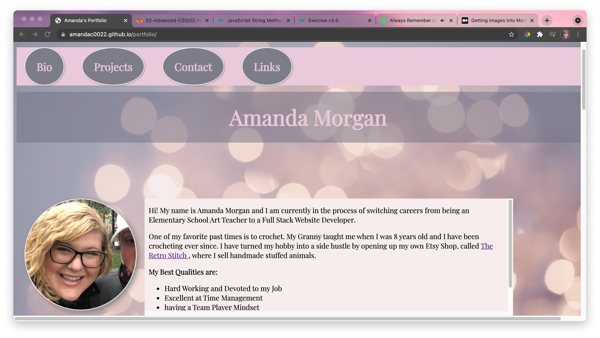
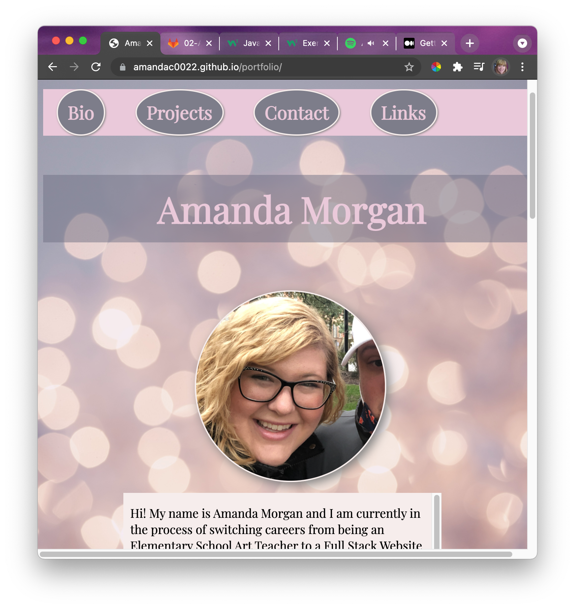

# Portfolio
## Description of Project 
In this activity we were asked to create a portfolio with work samples. The work samples are linked to my deployed webpages. My navagation bar links to different sections of my page, which helps the user navigate around my page better. If you hover over my profile picture, you will see a little surprise. My webpage is responsive and adopts to multiple viewpoints. I have included two screenshots below to show the different layouts. 

## Deployed Website Link: 
https://amandac0022.github.io/portfolio/

## Github Repository Link: 
https://github.com/AmandaC0022/portfolio

## Screenshot of Deployed Project (FullScreen): 

## Screenshot of Deployed Project (Responsive): 
 
